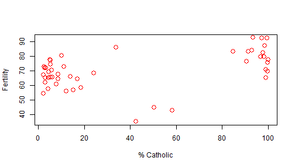
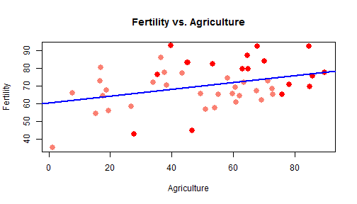

<style>
.footer {
    color: black;
    background: #E8E8E8;
    position: fixed;
    top: 90%;
    text-align:center;
    width:100%;
}
</style>

The Swiss Fertility Project
========================================================
author: Patrick Simon
date: August 3rd 2019
autosize: true
transition: rotate
font-family: 'Helvetica'
css: pres.css

<br>
<p align="left">

</align>
<br>

The basic idea
========================================================
type: section
class: small-code

I wanted to create a way to visualize the `swiss` dataset that is included
with R. It contains data on the fertility in various Swiss states, together
with a number of possible predictors: 


```r
data(swiss)
head(swiss,2)
```

```
           Fertility Agriculture Examination Education Catholic
Courtelary      80.2        17.0          15        12     9.96
Delemont        83.1        45.1           6         9    84.84
           Infant.Mortality
Courtelary             22.2
Delemont               22.2
```


Input variables
========================================================
type: section
class: small-code

The `Fertility` column should be able to be plotted against the `Agriculture`,
`Examination`, `Education` and `Infant.Mortality` columns. 

I also wanted a way
to split the data by majority Catholic/Protestant states, because those are
pretty clearly separated.

***

As seen here:


```r
plot(swiss$Catholic,swiss$Fertility,
     col="red", xlab="% Catholic",
     ylab="Fertility",cex=1.5)
```




Linear regression
========================================================
type:section

Then, after chosing the subset of interest, the user should use his mouse
to select a range of the points. A linear regression model will be fitted
to these points, with the slope and intercept outputs returned in the 
sidebar of the app.




Link to the app
========================================================
type:section

You can find the published app at the following address:

**https://psim3141.shinyapps.io/09p_ShinyApp/**

Please enjoy!
